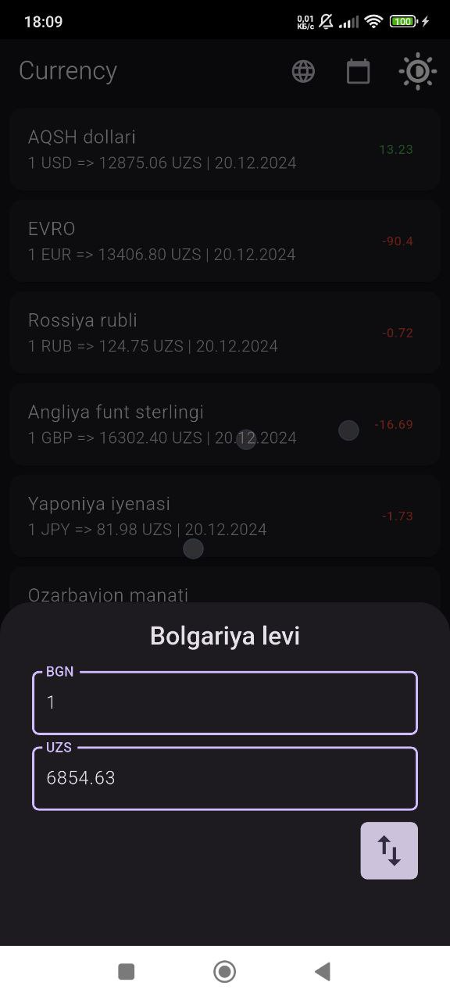

# Currency - Flutter App

Welcome to the **Currency** repository! This is a Flutter app designed to calculate currency conversions and display recent exchange rates. The app allows users to perform real-time currency calculations and view exchange rate data for the last few days. It supports **Day/Night Theme** and provides a seamless user experience with **Flutter**, **Dio**, **Retrofit**, **Bloc**, and more.

---

### 💱 **App Overview**

**Currency** is a Flutter app that allows users to:
- Calculate currency conversions.
- View recent exchange rate data.
- Switch between **Day** and **Night** themes.
- Store and retrieve settings with **SharedPreferences** for a personalized experience.

The app fetches real-time exchange rate data using **Dio** and **Retrofit** for network calls, while **Bloc** is used for state management. The **Freezed** package is used for immutable data structures, ensuring that the app’s state management is predictable and robust.

---

### 🚀 **Features**

- **Currency Conversion**: Calculate real-time currency conversions based on the latest exchange rates.
- **Recent Exchange Rates**: View exchange rates from the last few days.
- **Day/Night Theme**: Switch between light and dark themes for a better user experience.
- **Shared Preferences**: Save user settings (such as the selected theme) and preferences locally.
- **Dio and Retrofit**: Fetch real-time currency data from a reliable API using **Dio** and **Retrofit**.
- **Freezed**: Immutable data handling to ensure reliable and consistent state management.

### ⚙️ **Technologies Used**

- **Flutter**: Built with Flutter, ensuring a smooth and responsive UI for both iOS and Android platforms.
- **Dio**: A powerful HTTP client for making API calls and handling network requests.
- **Retrofit**: A type-safe HTTP client for **Dio**, used to fetch currency exchange data.
- **Bloc**: Manages state in a reactive and efficient manner, ensuring clean and maintainable code.
- **Provider**: Used for dependency injection and managing app-wide state.
- **Freezed**: Helps define immutable data classes to handle the app's state in a type-safe manner.
- **SharedPreferences**: Stores user settings like theme preferences and other app configurations.
- **Day/Night Theme**: Easily toggle between light and dark modes using Flutter’s theme management system.

<table>
  <tr>
    <td></td>
    <td></td>
  </tr>
  <tr>
    <td></td>
    <td></td>
  </tr>
  <tr>
    <td></td>
  </tr>
</table>